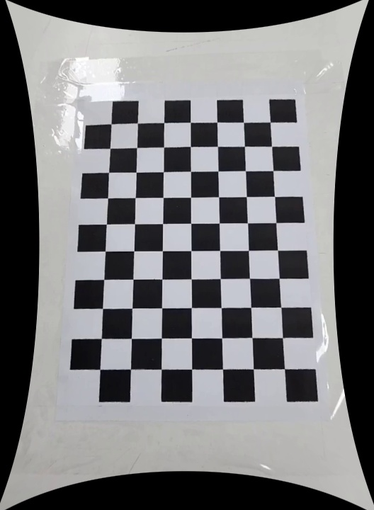
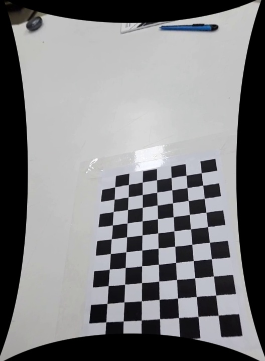

# Distorted-Chessboard-Video-Fixer

컴퓨터비전 과목의 카메라 캘리브레이션 과제를 위한 프로젝트입니다. 체커보드가 포함된 영상을 입력으로 사용하여 카메라의 내부 파라미터와 왜곡 계수를 추정하고, 왜곡이 보정된 이미지를 생성합니다.

---

## 프로젝트 구성

```text
.
├─ camera_calibration_hw3.py
├─ calibration_video.mp4
├─ undistorted_images/
│  ├─ undistorted_00.jpg
│  ├─ undistorted_01.jpg
│  └─ ...
└─ README.md
```

* `camera_calibration_hw3.py` : 카메라 캘리브레이션 코드
* `calibration_video.mp4` : 체커보드가 촬영된 입력 영상
* `undistorted_images/` : 왜곡 보정 후 저장되는 이미지

---

## 사용 방법

1. 체커보드가 촬영된 영상을 코드와 같은 디렉토리에 넣는다.
2. 체커보드의 내부 코너 수와 실제 한 칸 크기를 코드에 맞게 수정한다.
* Chessboard Collection 사이트에서 자료 참고 

```python
BOARD_PATTERN = (9, 6)
BOARD_CELL_SIZE = 0.025
```

예를 들어 체커보드가 10×7 칸이라면 내부 코너 수는 `(9, 6)`이다.

## 실행 과정

프로그램은 다음 순서로 동작한다.

1. 영상에서 일정 간격마다 프레임을 읽는다.
2. 체커보드의 내부 코너를 검출한다.
3. 검출된 프레임들만 사용하여 카메라 캘리브레이션을 수행한다.
4. 카메라 행렬과 왜곡 계수를 출력한다.
5. 왜곡이 보정된 이미지를 `undistorted_images` 폴더에 저장한다.

실행 중에는 체커보드의 내부 코너를 인식한 화면이 아래와 같이 표시된다.

```text
Frame 120 | detected 12
```

* 초록색 선: 체커보드 내부 코너 연결
* 빨간 점: 실제로 인식된 코너 위치

---

## 실제 출력

```text
========== Camera Calibration Result ==========
Used images : 40
Image size  : 528 x 720
RMSE        : 0.457165

[Camera Matrix K]
[[974.2716024    0.         245.54479479]
 [  0.         962.19346795 334.38891575]
 [  0.           0.           1.        ]]

[Distortion Coefficients]
[-0.64928446 -0.22131132  0.01132264  0.01037029  0.46393111]
```

### 주요 파라미터 의미

* `fx`, `fy` : 카메라의 초점거리
* `cx`, `cy` : 이미지 중심점(principal point)
* Distortion Coefficients : 렌즈 왜곡 정도
* RMSE : 재투영 오차. 작을수록 더 정확한 캘리브레이션

일반적으로 RMSE가 1 이하이면 비교적 좋은 결과로 볼 수 있다.

---

## 결과 이미지


```markdown


```

